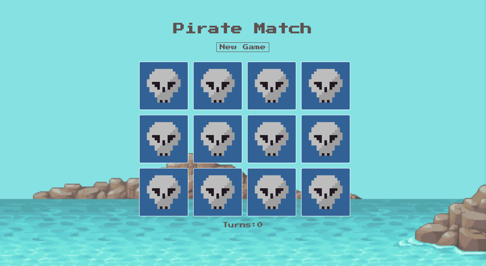
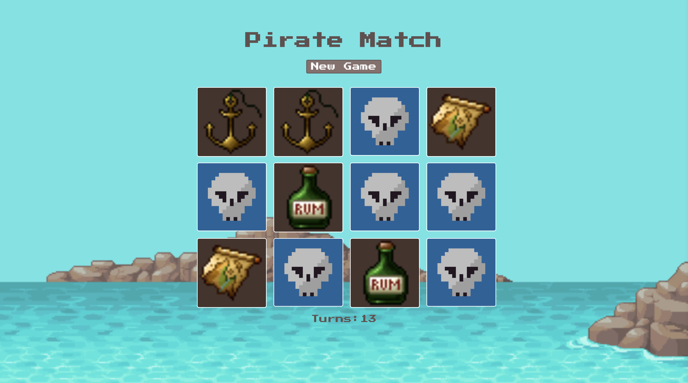

# ☠️🏴‍☠️Pirate Match🏴‍☠️☠️

### Pirate Match is a single page memory game created entirely with React and CSS. The user has the ability to start a new game which then fires a function that randomly shuffles each card. Then the user can go through and match the cards keeping count at the bottom of how many turns its taken to match the entire board.

